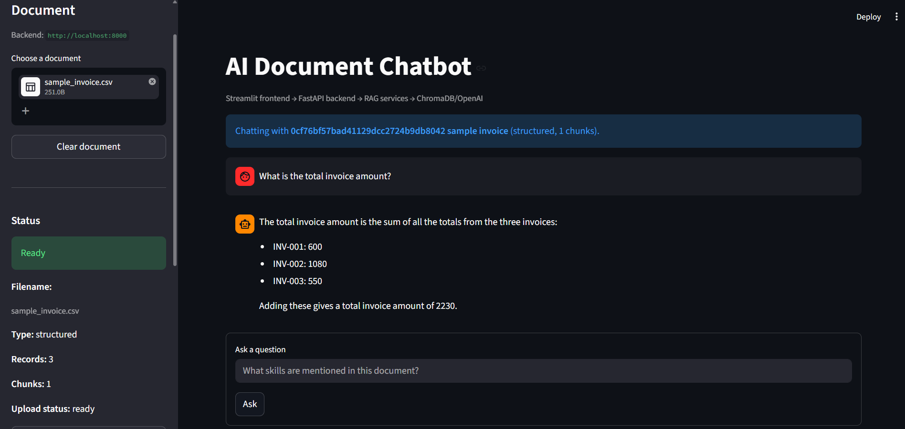
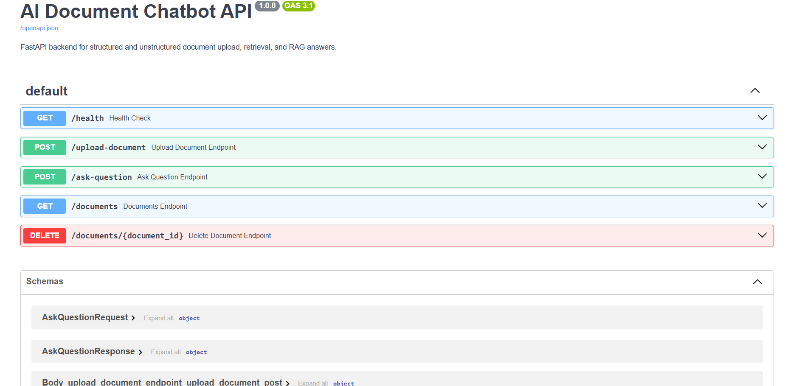

# AI Document Chatbot

An end-to-end Retrieval-Augmented Generation application for querying structured and unstructured documents through a conversational interface.

The system uses a Streamlit frontend, a FastAPI backend, reusable RAG service modules, ChromaDB for vector search, sentence-transformer embeddings, and OpenAI for grounded answer generation.

## Screenshots

### Streamlit Chat Interface



### FastAPI Documentation



## Architecture

```text
Streamlit frontend
  |
  v
FastAPI backend
  |
  v
RAG service layer
  |
  |-- Document normalization
  |-- Text chunking
  |-- Embedding generation
  |-- ChromaDB vector retrieval
  |-- OpenAI answer generation
```

The frontend is intentionally thin. It handles user interaction and delegates document processing, retrieval, and answer generation to the backend API.

## Supported Inputs

The application supports both unstructured and structured files.

Unstructured inputs:

- PDF
- TXT

Structured inputs:

- CSV
- JSON
- XLSX
- XLS

Structured files are converted into row-oriented or record-oriented text before indexing. This allows the same RAG pipeline to work across documents, spreadsheets, and datasets.

## Key Capabilities

- Upload and index structured and unstructured documents.
- Extract or normalize document content into searchable text.
- Split text into overlapping chunks for retrieval.
- Generate local embeddings with sentence-transformers.
- Store vectors persistently with ChromaDB.
- Retrieve relevant context using semantic similarity search.
- Generate grounded answers with OpenAI.
- Display source sections used for answer generation.
- Expose document operations through FastAPI endpoints.
- Provide a Streamlit chatbot interface for document querying.
- Load configuration and API keys from environment variables.
- Handle common API, parsing, and document processing errors.

## Tech Stack

- Python
- Streamlit
- FastAPI
- Uvicorn
- ChromaDB
- Sentence Transformers
- LangChain text splitters
- OpenAI Python SDK
- pypdf
- pandas
- openpyxl
- python-dotenv

## Project Structure

```text
ai-document-chatbot/
  app.py
  Dockerfile
  docker-compose.yml
  requirements.txt
  README.md
  .env.example
  .gitignore
  documents/
    .gitkeep
  sample_documents/
    sample_invoice.csv
    sample_policy.txt
    sample_records.json
  screenshots/
    fastapi-docs.png
    streamlit-chatbot-answer.png
  tests/
    test_api.py
  vector_store/
  backend/
    __init__.py
    main.py
    models.py
    services/
      __init__.py
      document_service.py
  utils/
    __init__.py
    document_reader.py
    pdf_reader.py
    text_chunker.py
    embeddings.py
    retriever.py
    llm_answer.py
```

## Backend API

The FastAPI backend exposes the following endpoints.

| Method | Endpoint | Purpose |
| --- | --- | --- |
| GET | /health | Check backend availability |
| POST | /upload-document | Upload, normalize, chunk, embed, and index a document |
| POST | /ask-question | Retrieve relevant chunks and generate an answer |
| GET | /documents | List indexed documents |
| DELETE | /documents/{document_id} | Delete an indexed document and its vector collection |

Interactive API documentation is available at:

```text
http://localhost:8000/docs
```

## RAG Workflow

1. A user uploads a PDF, TXT, CSV, JSON, or Excel file through the Streamlit UI.
2. Streamlit sends the file to the FastAPI backend.
3. The backend normalizes the document into searchable text.
4. The normalized text is split into overlapping chunks.
5. Each chunk is embedded using a sentence-transformer model.
6. Chunks and embeddings are stored in ChromaDB.
7. A user asks a question in the frontend.
8. The backend embeds the question and retrieves the most relevant chunks.
9. Retrieved chunks are passed to OpenAI as grounded context.
10. The generated answer is returned to Streamlit.
11. The UI displays the answer and optionally shows the source sections used.

## Configuration

Create a `.env` file from `.env.example`.

```text
OPENAI_API_KEY=
OPENAI_MODEL=gpt-4.1-mini
BACKEND_API_URL=http://localhost:8000
```

Required configuration:

- OPENAI_API_KEY: OpenAI API key used by the backend for answer generation.

Optional configuration:

- OPENAI_MODEL: OpenAI model used for answer generation.
- BACKEND_API_URL: Backend URL used by the Streamlit frontend.

Do not commit `.env`. It is excluded from version control because it contains private credentials.

## Installation

Create and activate a virtual environment.

```bash
python -m venv venv
```

Windows PowerShell:

```powershell
.\venv\Scripts\Activate.ps1
```

macOS or Linux:

```bash
source venv/bin/activate
```

Install dependencies.

```bash
pip install -r requirements.txt
```

## Running Locally

Run the backend and frontend in separate terminals.

Terminal 1:

```bash
uvicorn backend.main:app --reload
```

The backend runs at:

```text
http://localhost:8000
```

Terminal 2:

```bash
streamlit run app.py
```

The frontend runs at:

```text
http://localhost:8501
```

## Docker

The project includes a Dockerfile for the FastAPI backend and a docker-compose configuration for running both services.

Build and start the backend and frontend:

```bash
docker compose up --build
```

Services:

```text
Backend:  http://localhost:8000
Frontend: http://localhost:8501
API docs: http://localhost:8000/docs
```

The compose file mounts local `documents/` and `vector_store/` folders so uploaded files and vector data can persist between container restarts.

## Testing

The test suite validates the main backend API contract without requiring OpenAI calls or embedding model downloads. External RAG dependencies are mocked during tests.

Run tests:

```bash
pytest
```

Covered endpoints:

- POST /upload-document
- POST /ask-question

## Deployment

The application can be deployed as two services.

Backend service:

- Runtime command: `python -m uvicorn backend.main:app --host 0.0.0.0 --port 8000`
- Required environment variable: `OPENAI_API_KEY`
- Optional environment variable: `OPENAI_MODEL`
- Persistent storage recommended for `documents/` and `vector_store/`

Frontend service:

- Runtime command: `streamlit run app.py --server.address 0.0.0.0 --server.port 8501`
- Required environment variable: `BACKEND_API_URL`

Recommended deployment targets:

- Docker Compose on a virtual machine
- Render or Railway for separate backend and frontend services
- Azure App Service or AWS Elastic Beanstalk for containerized deployment

For production use, add authentication, stricter CORS settings, file size limits, and managed persistent storage.

## Example Usage

1. Start the backend.
2. Start the frontend.
3. Upload a PDF, TXT, CSV, JSON, XLSX, or XLS file.
4. Ask a natural language question.
5. Review the generated answer.
6. Expand `Show relevant document sections` to inspect the retrieved source chunks.

Example questions:

```text
What is this document about?
What skills are mentioned?
What projects are described?
Which records match this condition?
Summarize the dataset.
What is the total amount on this invoice?
```

## Error Handling

The application handles common failure modes.

- Backend unavailable
- Missing OpenAI API key
- OpenAI quota or billing errors
- Unsupported file uploads
- Document extraction or parsing failure
- Scanned PDFs with no readable text
- Missing or deleted document records

The backend uses Python logging for operational visibility.

## Security Notes

- API keys are loaded from `.env`.
- `.env` is excluded from version control.
- `.env.example` provides safe configuration placeholders.
- The frontend does not hardcode OpenAI credentials.
- OpenAI calls are isolated in the backend service layer.
- Uploaded documents and local vector stores are excluded from Git by default.

## Design Decisions

- FastAPI separates business logic from the UI and exposes reusable API endpoints.
- Streamlit remains focused on the document-query user experience.
- Structured files are normalized into searchable text so they can use the same RAG pipeline as unstructured documents.
- ChromaDB provides lightweight local vector persistence.
- Sentence-transformer embeddings avoid sending document chunks to an external embedding API.
- Retrieved chunks are exposed for traceability and evaluation of answer grounding.

## Current Limitations

- The frontend is optimized for one active document at a time.
- PDF extraction works best with text-based PDFs.
- Scanned PDFs require OCR, which is not implemented yet.
- ChromaDB persistence is local to the project environment.
- Authentication and multi-user isolation are not implemented.

## Future Improvements

- Multi-document querying
- OCR support for scanned PDFs
- User authentication
- Conversation history
- Dockerized deployment
- Cloud vector database integration
- Retrieval and answer quality evaluation
- Automated API tests and continuous integration

## Resume Summary

This project demonstrates a full-stack RAG architecture with a Streamlit frontend, FastAPI backend, vector retrieval layer, and LLM-based answer generation. It includes document ingestion, structured and unstructured data normalization, semantic search, grounded response generation, API design, environment-based configuration, and source traceability.
